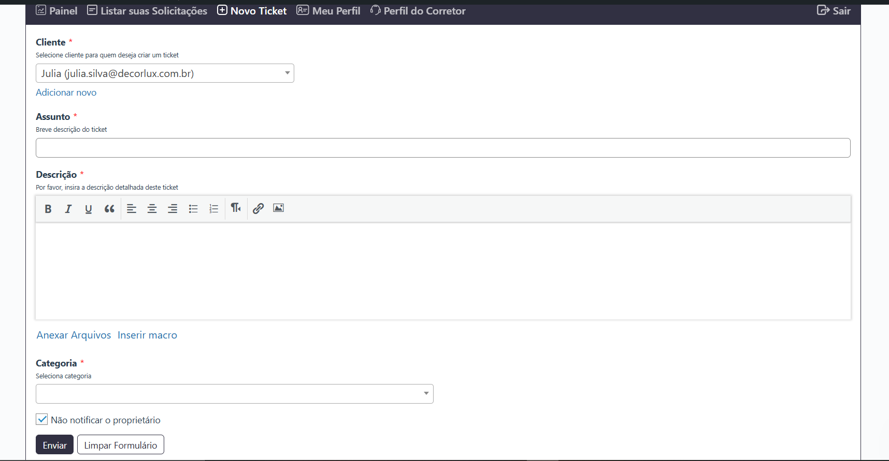
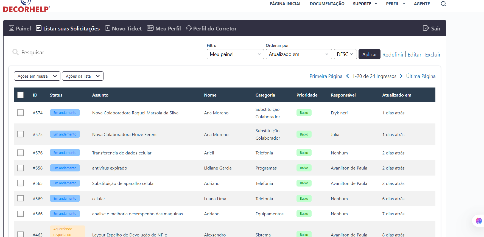
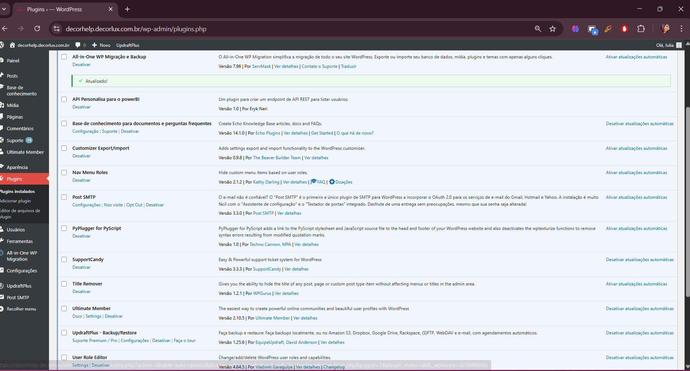

# 🎯 DecorHelp - Sistema Interno de Chamados | Decorlux

🔧 Projeto **real** criado para uso interno da empresa [Decorlux](https://www.decorlux.com.br/), o **DecorHelp** é um sistema web de abertura e gestão de chamados internos entre setores, desenvolvido em **WordPress** com customizações via **APIs, plugins específicos e painel administrativo próprio**.

---

## 🚀 Objetivo

Facilitar a comunicação entre os colaboradores e os setores de suporte e TI da empresa, automatizando o fluxo de abertura, acompanhamento e resolução de chamados internos com agilidade, organização e rastreabilidade.

---

## 🛠️ Tecnologias e Ferramentas

- WordPress como CMS base
- PHP e MySQL (customizações e back-end)
- HTML5, CSS3, JavaScript e jQuery (customizações no front)
- Bootstrap para responsividade
- API REST do WordPress
- Painel administrativo customizado
- Hospedagem HostGator (ambiente de produção)

---

## 🔌 Plugins e Recursos Usados

- **SupportCandy** → sistema de tickets com controle de status, prioridade e histórico  
- **Ultimate Member** → controle de login e permissões por tipo de usuário  
- **API personalizada para Power BI** → integração para leitura de dados internos via REST  
- **Echo Knowledge Base** → base de conhecimento interna (FAQ automatizado)  
- **Post SMTP** → envio automático de notificações por e-mail  
- **User Role Editor / Nav Menu Roles** → controle avançado de menus e acessos  
- **PyPlugin for PyScript** → melhorias de compatibilidade e ajustes no carregamento  
- **Title Remover** → refinamento visual nas páginas internas

---

## 👩‍💻 Minhas Responsabilidades

- Desenvolvimento completo do sistema no WordPress
- Criação e configuração de plugins e integrações internas
- Estruturação lógica do fluxo de chamados (criação, prioridade, status)
- Integração com API personalizada para relatórios externos
- Customização de interfaces e hierarquia de usuários
- Deploy e manutenção na HostGator

---

## 📷 Capturas de Tela

|  |  |  |  |

---

## 🌐 Link

🔗 [https://decorhelp.decorlux.com.br](https://decorhelp.decorlux.com.br)  
> *(Sistema de uso interno. Algumas áreas exigem login.)*

---

## 📌 Status do Projeto

✔️ Sistema em uso atualmente pela equipe Decorlux  
🔄 Melhorias aplicadas conforme feedback interno  

---

## ✨ Destaques Técnicos

- Arquitetura de sistema utilizando WordPress como estrutura de sistema, e não apenas blog
- Integrações REST e manipulação de dados via PHP + WP_Query
- Interface intuitiva e responsiva para múltiplos tipos de usuários
- Acesso segmentado com controle total de permissões

---

## 🧠 Aprendizados

- Utilização de WordPress além do CMS tradicional
- Integração de APIs com segurança e estrutura clara
- Criação de lógica de sistema para controle interno de processos
- Gerenciamento de deploy e produção com segurança e estabilidade

---

## ⚠️ Aviso

> Este repositório serve como **portfólio técnico e vitrine de projeto real**. O código-fonte completo não é público por conter dados e integrações internas da empresa.

---

Feito com 💙 por [Julia Martins](https://github.com/juhmartins-04)
